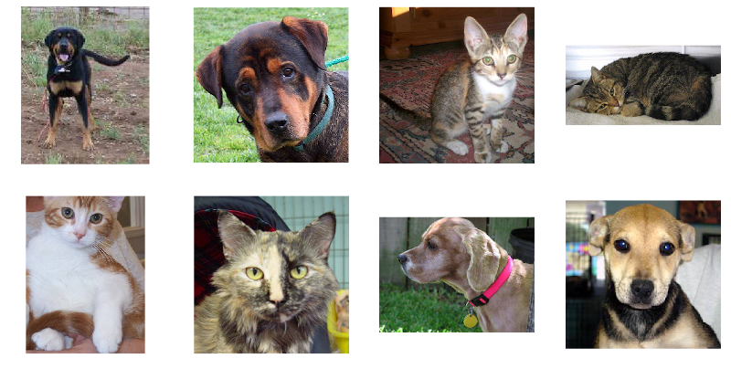

# dogs-vs-cats-pytorch

This is my solution to the Kaggle challenge [Dogs vs. Cats](https://www.kaggle.com/c/dogs-vs-cats/).

In this competition, we have to write an algorithm to classify whether images contain either a dog or a cat.

The dataset provided by Kaggle contains 25,000 images of dogs and cats.

I used a [neural network](https://en.wikipedia.org/wiki/Neural_network) model, [DenseNet](https://pytorch.org/docs/master/torchvision/models.html#id5), trained on [ImageNet](http://www.image-net.org/) and available from [torchvision](https://pytorch.org/docs/master/torchvision/index.html).

I achieved an accuracy rate of 97% on new images.

The [Jupyter Notebook](https://jupyter.org) is directly exported from [Google Colaboratory](https://colab.research.google.com/).
